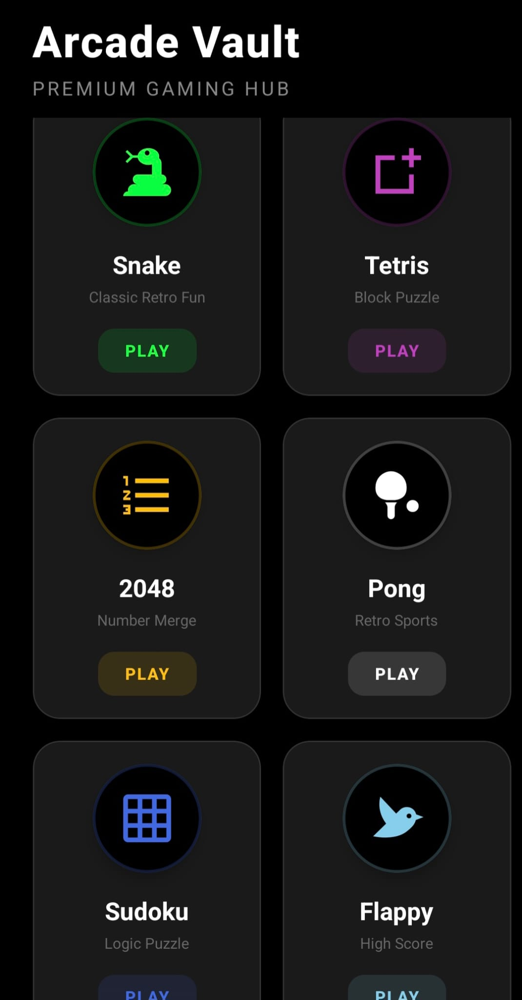

# 🕹️ Arcade Vault: The Resurrection of Retro
### From 30,000 Files of Chaos to a High-Performance Native Engine

> "This isn't just a gaming app. It's a masterclass in migration, a victory over legacy bloat, and a showcase of modern mobile architecture."

---

## 📸 Project Preview

*High-fidelity retro graphics, smooth Native UI, and haptic-responsive gameplay.*

---

## 📥 Install & Play (User Guide)
**No coding knowledge required. Follow these steps to get the Arcade on your phone:**

| 🤳 Scan to Install | 🔗 Direct Download |
| :--- | :--- |
|  | [📲 Download Arcade Vault APK](https://expo.dev/accounts/benmoshe/projects/arcade-vault) |

**Quick Start:**
1. Scan the QR code or click the download link above.
2. Open the downloaded `.apk` file on your Android device.
3. If prompted, allow "Installation from unknown sources".
4. Enjoy a 100% offline gaming experience.

---

## 📖 The Journey: The Reverse Engineering Mission
This project began with a daunting challenge. I inherited a legacy codebase from a web-based environment (Replit) that was practically unusable. It was a "black box" drowning in over **30,000 redundant files**, broken dependencies, and an outdated architecture that couldn't even boot on a physical device.

As a 3rd-year Computer Science student, I approached this as a professional **Migration & Optimization** mission. I stripped the project to its absolute core, eliminated the "bloatware," and rebuilt the entire infrastructure on **React Native** and **Expo SDK 54**.

---

## 🚧 The Infrastructure War: "Battle of SDK 54"
The biggest hurdle wasn't the games—it was the foundation. During the transition to Expo SDK 54, we encountered the infamous **Error 500 (Unable to resolve module)**.

### The Conflict:
A critical mismatch between React 18/19 and Expo's peer dependencies created a "dependency hell." The cloud build servers (EAS) refused to compile the project.

### The Resolution:
1. **Hard Reset:** Performed a global wipe of `node_modules` and `package-lock.json`.
2. **Legacy Resolution:** Implemented a `--legacy-peer-deps` strategy to force stability.
3. **CI/CD Optimization:** Created a custom `.npmrc` configuration, allowing the **EAS Build** server to mirror the local development environment.
4. **Result:** A clean, 100% reproducible build pipeline that works in both local and cloud environments.

---

## 🎮 Game Engine Deep-Dive

### 🧊 Tetris Pro: Matrix Dynamics
This is a mathematically rigorous implementation of Tetris.
* **Rotation Matrix:** Utilizes a 2D coordinate transformation:
  $$R = \begin{pmatrix} 0 & 1 \\ -1 & 0 \end{pmatrix}$$
* **Wall Kick Algorithm:** Handles complex rotations when blocks are adjacent to boundaries, preventing "stuck" states.
* **Ghost Piece Logic:** Real-time shadow projection using a recursive collision-checking loop.

### 🏓 Pong Evolution: AI & Physics
Features a non-deterministic AI. Instead of a "perfect wall" paddle, the CPU uses **Linear Interpolation (Lerp)** with a simulated reaction delay, creating a challenging and "human-like" opponent.

### 🐍 Snake & 2048
Optimized for zero-latency. Used `useRef` hooks to manage the game loops without triggering expensive React re-renders, ensuring a consistent **60 FPS** experience.

---

## 🛠️ Developer Setup
If you wish to explore the source code:
1. **Clone:** `git clone https://github.com/BenMosheashvili/Arcade-Vault-Offline-Games.git`
2. **Install:** `npm install --legacy-peer-deps`
3. **Run:** `npx expo start -c`

---

## 👨‍💻 Developed By
**Ben Mosheashvili**
*3rd Year Computer Science Student @ Ashkelon Academic College*

 While I have a deep-seated love for the flexibility of **JavaScript**, I chose to architect this project in **TypeScript**. This choice was driven by a commitment to high-quality, strict, and predictable code—ensuring that Arcade Vault isn't just a fun app, but a reliable piece of software.

---
